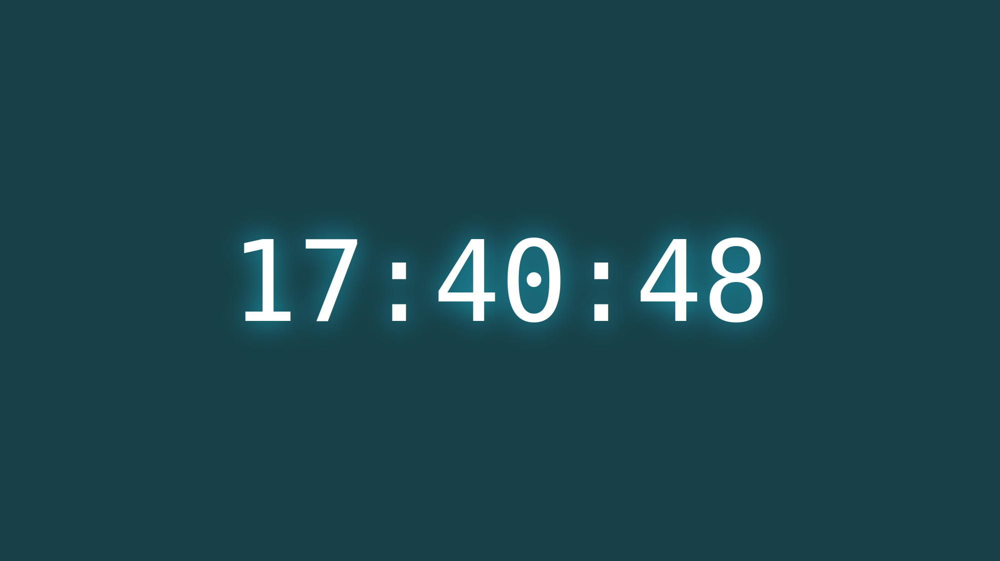

# What colour is it?

Get the current time (24h clock) in the format `hh:mm:ss` and convert it to a 
hexadecimal colour of the form `#hhmmss`.

Use that colour as the background for a static web page that displays only the 
current time in the center.

## Example

## Requirements

- Build your webpage in webassembly using [yew](https://yew.rs/docs/getting-started/build-a-sample-app#setting-up-the-application-manually).
- Push the result to main and verify that [CI passes](https://github.com/jltorresm/what-colour-is-it/actions).
- Visit [the page](https://blog.j2e.co/what-colour-is-it).
